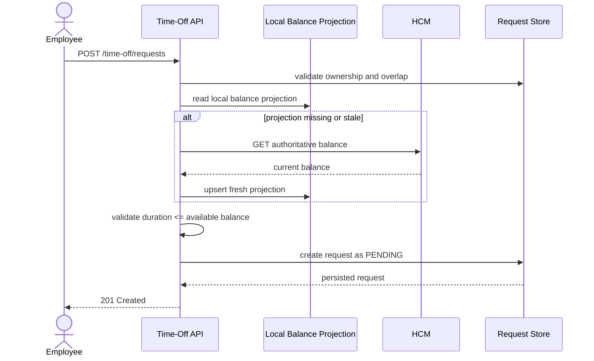
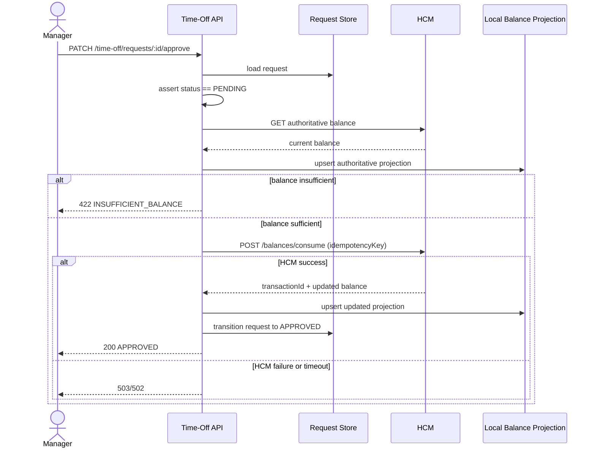
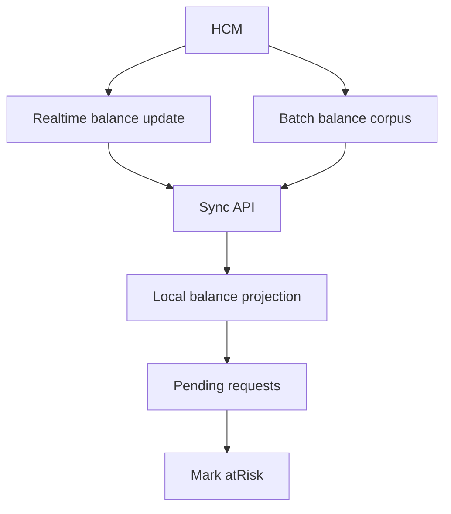
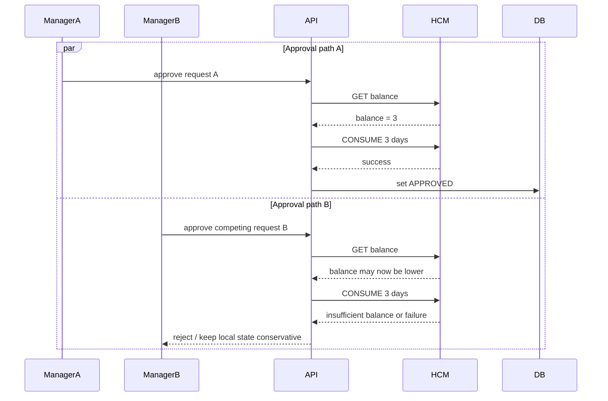
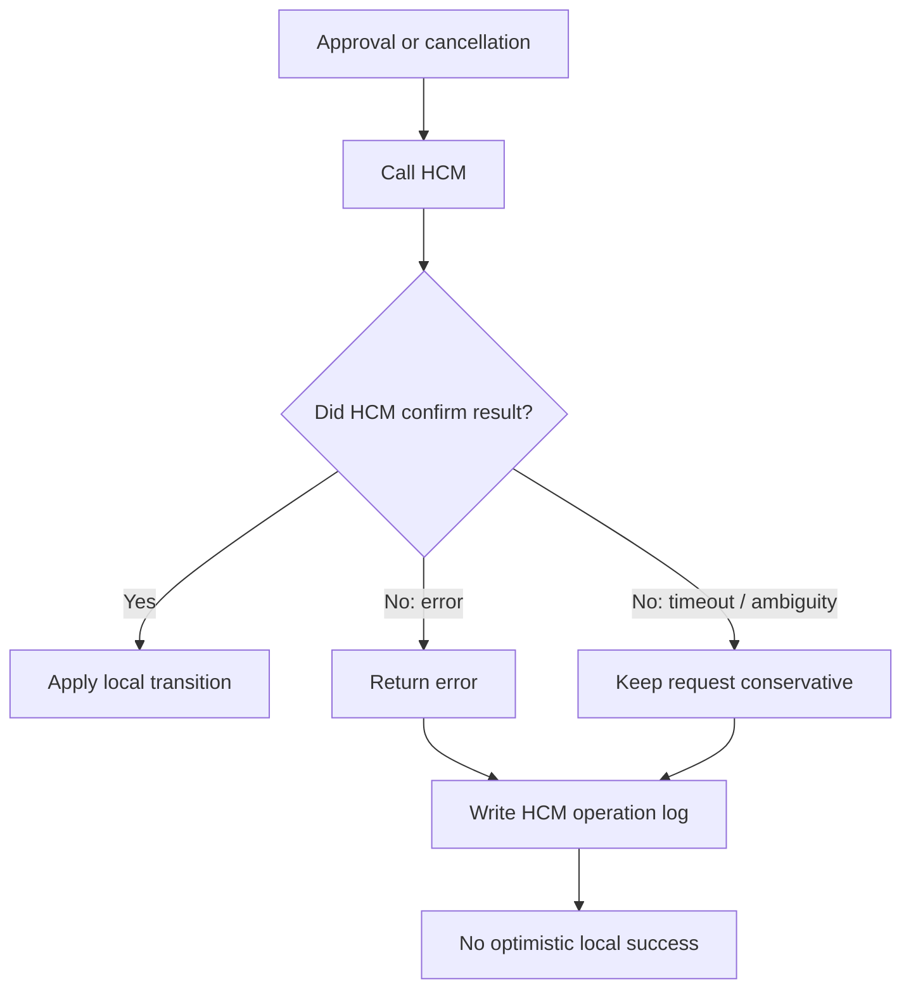

# Time-Off Microservice


**Repository:** [github.com/daviixs/time-off-service](https://github.com/daviixs/...)

**Repository:** [github.com/daviixs/time-off-service](https://github.com/daviixs/...)

> Backend microservice for managing time-off requests with **HCM as the source of truth for balances** and **local state responsible for the request workflow**.
> The solution prioritizes balance integrity, defensive synchronization, auditing, idempotency, and quality evidence through tests.

## Table of Contents

- [Overview](#overview)
- [Technical Challenge Context](#technical-challenge-context)
- [The Problem](#the-problem)
- [Involved Personas](#involved-personas)
- [Solution Architecture](#solution-architecture)
- [Diagrams](#diagrams)
- [Chosen Technologies and Justifications](#chosen-technologies-and-justifications)
- [How to Run](#how-to-run)
- [Environment Variables](#environment-variables)
- [API Endpoints](#api-endpoints)
- [Core Flows](#core-flows)
- [HCM Synchronization Strategy](#hcm-synchronization-strategy)
- [Balance Integrity Strategy](#balance-integrity-strategy)
- [Correctness Hardening](#correctness-hardening)
- [Technical Decisions](#technical-decisions)
- [Considered Alternatives](#considered-alternatives)
- [Project Structure](#project-structure)
- [Tests](#tests)
- [Mock HCM](#mock-hcm)
- [Covered Critical Scenarios](#covered-critical-scenarios)
- [Known Limitations](#known-limitations)
- [Next Steps](#next-steps)
- [Author](#author)

## Overview

The **Time-Off Microservice** was designed to solve a classic integration problem: allowing employees and managers to operate time-off requests with low latency and good product feedback, without violating the fact that the **HCM remains the final authority on balances**.

In practice, this means clearly separating two responsibilities:

- **HCM**
  - source of truth for balances
  - external system that can be altered by ReadyOn and by other independent processes
- **Time-Off Microservice**
  - local authority for the request lifecycle
  - local balance cache/projection for fast reading
  - defensive layer of validation, auditing, and synchronization

The result is a service that:

- creates requests with local validation + defensive refresh when necessary
- revalidates the balance in the HCM before approval
- restores the balance in the HCM when canceling an approved request
- processes **batch** and **realtime** synchronization
- treats inconsistency, timeout, and HCM errors as first-class events

## Technical Challenge Context

The challenge starts from the scenario where a time-off module is the primary interface for employees, while an external HCM, such as Workday or SAP, remains the master system for employment and balance data.

The core requirements of the challenge are:

- build a backend with NestJS, TypeScript, and SQLite
- maintain balance integrity even with external changes in the HCM
- treat HCM as the final authority
- support **realtime** and **batch** synchronization
- adopt a defensive approach against incomplete or inconsistent HCM errors
- use tests as the primary evidence of quality

This repository answers these requirements with:

- REST API for request, approval, rejection, cancellation, and balance inquiry
- local cache/projection in SQLite
- HCM client with logging and error normalization
- mock HCM with scenarios for seed, error, logical delay, and external balance changes
- suite of unit, integration, and e2e tests

## The Problem

Synchronizing balances between two systems is difficult because the local service **is not the sole writer** in the HCM.

The main risks of this domain are:

- **stale reads**
  - the balance queried locally may already be outdated at the time of approval
- **dual-writer**
  - the HCM can be altered by external processes, such as anniversary bonuses or annual refreshes
- **insufficient balance not properly reported**
  - the HCM might not return a consistent error in all scenarios
- **concurrency**
  - two simultaneous actions may compete for the same balance
- **ambiguity in failures**
  - a timeout when writing to the HCM cannot be treated as an optimistic success

The solution design explicitly assumes that:

- **SQLite is never the final source of balances**
- **approval without revalidation in the HCM is forbidden**
- **failure or ambiguity in the HCM keeps the local state conservative**

## Involved Personas

| Persona                  | Objective                                  | Main Risk                                            | System Response                                     |
| ------------------------ | ------------------------------------------ | ---------------------------------------------------- | --------------------------------------------------- |
| Employee                 | Request time-off and see reliable balance  | receiving a stale balance or illusory approval       | fast local projection + refresh from HCM when stale |
| Manager                  | Approve safely                             | approving a request already invalid in the HCM       | mandatory revalidation before approval              |
| HR / HCM                 | Apply external balance changes             | drift between HCM and local service                  | batch + realtime synchronization                    |
| Engineering / Operations | Evolve the system safely                   | regressions and silent inconsistency                 | tests, auditing, and reproducible mock HCM          |

## Solution Architecture

The service follows a modular architecture, with a clear separation between:

- **local workflow**
  - requests
  - authorization via mocked headers
  - auditing
- **local projection**
  - balances in SQLite
  - freshness TTL
  - `atRisk` marking
- **external integration**
  - reading and writing to the HCM
  - error normalization
  - idempotency for consume/restore operations

### Main Components

- `RequestsService`
  - creates, approves, rejects, and cancels requests
- `BalancesService`
  - resolves balance reading with a freshness policy
- `SyncService`
  - processes inbound synchronizations from the HCM
- `HcmClientService`
  - encapsulates outbound communication with the HCM
- `SQLite / Prisma`
  - stores workflow state and local balance projection

### Consistency Model

- **balance**
  - final authority: HCM
- **request status**
  - final authority: local microservice
- **approval**
  - only occurs after consumption confirmation in the HCM
- **approved cancellation**
  - only finalized after restore confirmation in the HCM

## Diagrams

### 1. Architecture Diagram (ASCII)

Logical view of the solution. The diagram shows the target architecture of the service; in the current delivery, SQLite keeps the application in a single-node topology, but the separation between API instances and the state layer remains valid as a boundary of responsibility.

```text
┌──────────────────────────── Client Boundary ─────────────────────────────┐
│                                                                          │
│   ┌──────────────┐                           ┌──────────────┐             │
│   │   Employee   │                           │   Manager    │             │
│   └──────┬───────┘                           └──────┬───────┘             │
│          │                                              │                 │
└──────────┼──────────────────────────────────────────────┼─────────────────┘
           │                                              │
           ▼                                              ▼
┌────────────────────────── Time-Off Service Boundary ─────────────────────┐
│                                                                          │
│   ┌──────────────────┐            ┌──────────────────┐                   │
│   │  API Instance A  │            │  API Instance B  │                   │
│   │  NestJS / REST   │            │  NestJS / REST   │                   │
│   └────────┬─────────┘            └────────┬─────────┘                   │
│            │                               │                             │
│            └───────────────┬───────────────┘                             │
│                            ▼                                             │
│                 ┌──────────────────────────┐                              │
│                 │ Application Services     │                              │
│                 │ Requests / Balances      │                              │
│                 │ Sync / HCM Client        │                              │
│                 └────────────┬─────────────┘                              │
│                              │                                            │
│          ┌───────────────────┴───────────────────┐                        │
│          ▼                                       ▼                        │
│   ┌─────────────────────┐               ┌─────────────────────┐           │
│   │ SQLite              │               │ Audit / Sync Logs   │           │
│   │ Workflow State      │               │ HCM Operations      │           │
│   │ Balance Projection  │               │ Sync Runs           │           │
│   └─────────────────────┘               └─────────────────────┘           │
│                                                                          │
└───────────────────────────────┬───────────────────────────────────────────┘
                                │
                                ▼
┌──────────────────────── External System Boundary ────────────────────────┐
│                                                                          │
│   ┌──────────────────────────────────────────────────────────────────┐   │
│   │ HCM API                                                         │   │
│   │ - GET balance                                                   │   │
│   │ - CONSUME balance                                               │   │
│   │ - RESTORE balance                                               │   │
│   │ - Batch / Realtime sync source                                  │   │
│   └──────────────────────────────────────────────────────────────────┘   │
│                                                                          │
└──────────────────────────────────────────────────────────────────────────┘
```

This design highlights the most important point of the domain: **the API can logically scale, but the final balance does not leave the local base; it must always converge with the HCM**.

### 2. Time-Off Request Creation Flow



This flow exists to balance **fast UX** with **data safety**. The creation uses the local projection when it is still reliable, but does not hesitate to query the HCM when the projection is stale or missing.

### 3. Approval Flow (Critical)



This is the center of the system's integrity. Approval **never** depends solely on the local cache. The HCM is queried at the critical moment, and the local transition only happens after external confirmation.

### 4. Synchronization Flow (Batch + Realtime)



This flow covers the fact that the HCM can change outside the microservice. The role of sync is not to "validate requests"; it is to **rebuild the local projection** and signal operational risk on pending requests.

### 5. Concurrency / Race Condition Flow



The system does not assume that concurrency will be resolved only locally. The real guarantee comes from the combination of:

- revalidation in the HCM
- idempotent writing
- conservative local transition in case of error

### 6. Anti-Inconsistency Flow



This flow shows the main defensive rule of the solution: **if the HCM did not confirm, the local system does not invent success**.

## Chosen Technologies and Justifications

| Technology                       | Role in the Solution                | Justification                                                           |
| -------------------------------- | ----------------------------------- | ----------------------------------------------------------------------- |
| NestJS                           | HTTP framework and modular composition | good separation by modules, controllers, and providers                  |
| TypeScript                       | static typing                       | reduces ambiguity in domain and contracts                               |
| Prisma                           | data access                         | productivity, clear schema, and strong integration with SQLite          |
| SQLite                           | local state + balance projection    | meets the scope of the take-home with a simple setup                    |
| `@prisma/adapter-better-sqlite3` | Prisma 7 runtime adapter            | supported path for SQLite with Prisma 7                                 |
| Jest                             | test suite                          | solid standard for unit, integration, and e2e                           |
| Supertest                        | HTTP testing                        | real validation of REST routes                                          |
| Custom Mock HCM                  | external system simulation          | allows controlling seed, error scenarios, inconsistency, and introspection |

## How to Run

### Local Execution

1. Install dependencies:

```bash
npm install
```

2. Generate Prisma client and sync schema:

```bash
npm run prisma:generate
npm run db:push
```

3. Seed local users:

```bash
npm run db:seed
```

4. Start the mock HCM in one terminal:

```bash
npm run mock:hcm
```

5. Start the API in another terminal:

```bash
npm run start:dev
```

### Note on Containerization

This delivery **does not include Docker or Docker Compose**, because containerization is not part of the implemented scope in this repository. The officially supported path in this submission is local execution.

### Quick Demo

Note: UUIDs, transaction IDs, and timestamps in the responses below are examples and will vary per run.

**1. Reset the mock HCM:**

```bash
curl -s -X POST http://127.0.0.1:4010/mock/reset
```

*Expected output:*
```json
{
  "reset": true
}
```

**2. Seed balance in the HCM:**

```bash
curl -s -X POST http://127.0.0.1:4010/mock/seed-balance \
  -H 'content-type: application/json' \
  -d '{
    "employeeId":"emp-001",
    "locationId":"loc-nyc",
    "leaveType":"VACATION",
    "availableDays":10,
    "sourceUpdatedAt":"2026-04-24T00:00:00.000Z"
  }'
```

*Expected output:*
```json
{
  "seeded": true
}
```

**3. Initial batch sync:**

```bash
curl -s -X POST http://127.0.0.1:3000/sync/batch \
  -H 'content-type: application/json' \
  -d '{
    "balances":[
      {
        "employeeId":"emp-001",
        "locationId":"loc-nyc",
        "leaveType":"VACATION",
        "availableDays":10,
        "sourceUpdatedAt":"2026-04-24T00:00:00.000Z"
      }
    ]
  }'
```

*Expected output:*
```json
{
  "processed": 1,
  "failed": 0,
  "skipped": 0
}
```

**4. Create a time-off request:**

```bash
curl -s -X POST http://127.0.0.1:3000/time-off/requests \
  -H 'content-type: application/json' \
  -H 'x-user-id: emp-001' \
  -H 'x-role: EMPLOYEE' \
  -d '{
    "employeeId":"emp-001",
    "locationId":"loc-nyc",
    "leaveType":"VACATION",
    "startDate":"2026-05-01",
    "endDate":"2026-05-03",
    "notes":"Trip"
  }'
```

*Expected output:*
```json
{
  "id": "req_12345abcde",
  "employeeId": "emp-001",
  "locationId": "loc-nyc",
  "leaveType": "VACATION",
  "startDate": "2026-05-01",
  "endDate": "2026-05-03",
  "durationDays": 3,
  "status": "PENDING",
  "atRisk": false,
  "notes": "Trip",
  "resolvedAt": null,
  "resolvedBy": null,
  "resolutionNotes": null,
  "createdAt": "2026-04-25T00:00:00.000Z",
  "updatedAt": "2026-04-25T00:00:00.000Z"
}
```

**5. Manager approves the request:**

*(Replace `req_12345abcde` with the actual ID returned from step 4)*

```bash
curl -s -X PATCH http://127.0.0.1:3000/time-off/requests/req_12345abcde/approve \
  -H 'content-type: application/json' \
  -H 'x-user-id: mgr-001' \
  -H 'x-role: MANAGER' \
  -d '{
    "notes": "Approved have a good trip"
  }'
```

*Expected output:*
```json
{
  "id": "req_12345abcde",
  "employeeId": "emp-001",
  "locationId": "loc-nyc",
  "leaveType": "VACATION",
  "startDate": "2026-05-01",
  "endDate": "2026-05-03",
  "durationDays": 3,
  "status": "APPROVED",
  "atRisk": false,
  "notes": "Trip",
  "resolvedAt": "2026-04-25T00:01:00.000Z",
  "resolvedBy": "mgr-001",
  "resolutionNotes": "Approved have a good trip",
  "createdAt": "2026-04-25T00:00:00.000Z",
  "updatedAt": "2026-04-25T00:01:00.000Z"
}
```

**6. Verify the updated balance:**

```bash
curl -s "http://127.0.0.1:3000/balances?employeeId=emp-001&locationId=loc-nyc&leaveType=VACATION" \
  -H 'x-user-id: emp-001' \
  -H 'x-role: EMPLOYEE'
```

*Expected output:*
```json
{
  "employeeId": "emp-001",
  "locationId": "loc-nyc",
  "leaveType": "VACATION",
  "availableDays": 7,
  "sourceUpdatedAt": "2026-04-25T00:01:00.000Z",
  "lastSyncedAt": "2026-04-25T00:01:00.000Z"
}
```

## Environment Variables

| Variable                         | Required | Role                                  |
| -------------------------------- | -------- | ------------------------------------- |
| `DATABASE_URL`                   | yes      | path to local SQLite                  |
| `HCM_BASE_URL`                   | yes      | base URL of the mock HCM or real HCM  |
| `HCM_PORT`                       | no       | port of the manual mock HCM runner    |
| `BALANCE_TTL_MS`                 | yes      | local balance projection TTL          |
| `BALANCE_DIMENSION_LEASE_TTL_MS` | no       | lease TTL per balance dimension       |
| `HCM_TIMEOUT_MS`                 | yes      | timeout for outbound HCM calls        |
| `PORT`                           | yes      | port for the NestJS API               |

Example:

```env
DATABASE_URL="file:./dev.db"
HCM_BASE_URL="http://127.0.0.1:4010"
HCM_PORT="4010"
BALANCE_TTL_MS="300000"
BALANCE_DIMENSION_LEASE_TTL_MS="30000"
HCM_TIMEOUT_MS="2000"
PORT="3000"
```

## API Endpoints

### Mocked Identity

User routes use trusted headers:

```http
x-user-id: emp-001
x-role: EMPLOYEE
```

or

```http
x-user-id: mgr-001
x-role: MANAGER
```

### Endpoints

| Method  | Path                             | Description               |
| ------- | -------------------------------- | ------------------------- |
| `GET`   | `/health`                        | liveness check            |
| `POST`  | `/time-off/requests`             | creates a request         |
| `GET`   | `/time-off/requests`             | lists requests            |
| `GET`   | `/time-off/requests/:id`         | fetches a request         |
| `PATCH` | `/time-off/requests/:id/approve` | approves a pending request|
| `PATCH` | `/time-off/requests/:id/reject`  | rejects a pending request |
| `PATCH` | `/time-off/requests/:id/cancel`  | cancels a request         |
| `GET`   | `/balances`                      | queries current projection|
| `POST`  | `/sync/realtime`                 | real-time balance ingest  |
| `POST`  | `/sync/batch`                    | batch balance ingest      |

### Example Payloads

Request creation:

```http
POST /time-off/requests
Idempotency-Key: create-request-001
```

```json
{
  "employeeId": "emp-001",
  "locationId": "loc-nyc",
  "leaveType": "VACATION",
  "startDate": "2026-05-01",
  "endDate": "2026-05-03",
  "notes": "Trip"
}
```

Approval:

```json
{
  "notes": "Approved"
}
```

Realtime sync:

```json
{
  "balance": {
    "employeeId": "emp-001",
    "locationId": "loc-nyc",
    "leaveType": "VACATION",
    "availableDays": 4,
    "sourceUpdatedAt": "2026-04-24T00:10:00.000Z"
  }
}
```

Standardized error:

```json
{
  "statusCode": 422,
  "error": "INSUFFICIENT_BALANCE",
  "message": "Requested 3 days but only 2 remain."
}
```

## Core Flows

### Creation

- validates identity and ownership
- accepts an optional `Idempotency-Key` for safe replay
- validates dates
- rejects overlaps
- uses local projection when fresh
- queries HCM when the projection is stale or missing
- creates the request as `PENDING`

### Approval

- requires `MANAGER` role
- reloads the request
- moves `PENDING` to `APPROVAL_IN_PROGRESS` before writing to the HCM
- revalidates in the HCM
- only consumes locally after a confirmed `consume` in the HCM
- moves to `APPROVAL_UNKNOWN` if the write result in the HCM is ambiguous
- updates local projection with the HCM return

### Cancellation

- `PENDING`: local cancellation
- `APPROVED`: moves to `CANCELLATION_IN_PROGRESS`, calls `restore` in the HCM, and only then finalizes as `CANCELLED`
- ambiguous restore result moves the request to `CANCELLATION_UNKNOWN`

### Synchronization

- `batch`: updates the local corpus, respecting `sourceUpdatedAt`
- `realtime`: updates a specific dimension and recalculates `atRisk`

## HCM Synchronization Strategy

The synchronization model combines two complementary mechanisms:

### Batch

Used for broad reconstruction of the local projection. It serves to converge the state of the microservice with the most recent photograph of the HCM.

Features:

- full corpus ingestion
- upsert by dimension
- discards payloads older than the local `sourceUpdatedAt`

### Realtime

Used for punctual and more recent mutations.

Features:

- specific update of one dimension
- discards stale event when the received `sourceUpdatedAt` is prior to or equal to the local projection
- recalculation of impacted pending requests
- marking `atRisk` without automatic status transition

### Why both exist

- batch resolves global convergence
- realtime resolves operational latency
- together, they reduce drift without relying solely on on-demand reads

## Balance Integrity Strategy

This is the central rule of the system:

> The local projection serves for reading and triage, but the HCM is the final authority before any approval.

### Used Mechanisms

- TTL for local projection
- defensive refresh upon detecting staleness
- mandatory revalidation in the HCM before approving
- idempotent writing in the HCM for `consume` and `restore`
- persistent state of HCM operation for safe replay
- lease per dimension `(employeeId, locationId, leaveType)` to serialize conflicting operations
- semantic validation of HCM payloads before any local upsert
- conservative failure on timeout or ambiguous error
- auditing of HCM operations

### What this prevents

- approval with a stale balance
- double approval due to false local success
- approved cancellation without an external restore
- blind trust in HCM error messages

## Correctness Hardening

This layer was added to transform the critical scenarios of the audit report into guarantees persisted in the system. The objective is to avoid duplication, ambiguous writes, stale overwrites, and balance corruption even under retries, timeouts, and concurrency.

| Risk                      | Implemented Mechanism                               | Guarantee                                                                                                        |
| ------------------------- | --------------------------------------------------- | ---------------------------------------------------------------------------------------------------------------- |
| Duplicate submit          | `RequestIdempotency` + `Idempotency-Key` header     | same key and same payload returns the original response; different payload returns `409 IDEMPOTENCY_KEY_REUSED`  |
| Duplicate approval        | `HcmOperation` with deterministic idempotency key   | `SUCCESS` operation is reused without calling the HCM again                                                      |
| HCM write timeout         | `APPROVAL_UNKNOWN` / `CANCELLATION_UNKNOWN` states  | the system does not invent local success when the external result is ambiguous                                   |
| Approve/cancel race       | `BalanceDimensionLease`                             | operations on the same balance dimension are serialized or rejected with `409 BALANCE_DIMENSION_LOCKED`          |
| Stale realtime sync       | comparison by `sourceUpdatedAt`                     | old event returns `{ "synced": false, "skipped": true }` without overwriting the projection                      |
| Inconsistent HCM payload  | shared semantic validator                           | divergent dimension, negative balance or invalid `sourceUpdatedAt` returns `502 INVALID_HCM_PAYLOAD`             |

### Additional States

The workflow now explicitly models intermediate and uncertainty states:

| Flow                  | Safe Transitions                                               |
| --------------------- | -------------------------------------------------------------- |
| Approval              | `PENDING -> APPROVAL_IN_PROGRESS -> APPROVED`                  |
| Ambiguous approval    | `PENDING -> APPROVAL_IN_PROGRESS -> APPROVAL_UNKNOWN`          |
| Approved cancellation | `APPROVED -> CANCELLATION_IN_PROGRESS -> CANCELLED`            |
| Ambiguous cancellation| `APPROVED -> CANCELLATION_IN_PROGRESS -> CANCELLATION_UNKNOWN` |

### Control Tables

| Table                   | Responsibility                                             |
| ----------------------- | ---------------------------------------------------------- |
| `RequestIdempotency`    | safe replay of request creation                            |
| `HcmOperation`          | durable state of outbound `CONSUME` and `RESTORE` operations|
| `BalanceDimensionLease` | SQLite-safe lease per balance dimension                    |
| `HcmOperationLog`       | append-only audit trail of HCM calls                       |

The important design point is that the system does not hold an open SQLite transaction during a network call. It uses short conditional transitions before/after the HCM and a durable operation to be able to resume or block replays based on the persisted state.

## Technical Decisions

| Decision                             | Reason                                                     |
| ------------------------------------ | ---------------------------------------------------------- |
| REST instead of GraphQL              | the domain is centered on explicit commands                |
| SQLite as local state                | meets the take-home with simple setup and low friction     |
| HCM as source of truth               | direct alignment with the proposed problem                 |
| Mandatory revalidation on approval   | avoids authorizing with a stale balance                    |
| Idempotency key in consume/restore   | protects against retries and ambiguity                     |
| Idempotency key on creation          | avoids duplicate requests in client retries                |
| Intermediate/unknown states          | explicitly models ambiguous external results               |
| Lease per balance dimension          | serializes conflicting operations in SQLite                |
| Batch + realtime sync                | covers both global convergence and specific updates        |
| Local auditing                       | traceability of integrations and failures                  |

## Considered Alternatives

| Alternative                                | Advantage                    | Reason for not choosing                                                               |
| ------------------------------------------ | ---------------------------- | ------------------------------------------------------------------------------------- |
| Reserve balance locally on creation        | early feedback               | more easily breaks the "HCM is the final authority" model                             |
| Outbox/eventual consistency for approval   | higher operational robustness| increases complexity and weakens safe synchronous approval                            |
| GraphQL                                    | reading flexibility          | does not improve the command-heavy flows of this challenge                            |
| PostgreSQL                                 | better concurrency and scale | out of scope of the mandatory take-home stack                                         |
| Pessimistic lock via long transaction      | simple serialization         | holding a transaction open over the network increases risk of blocking and operational deadlock |

## Project Structure

```text
src/
├── audit/
├── balances/
├── common/
├── employees/
├── hcm/
├── integration/
├── prisma/
├── shared/
├── sync/
└── time-off/

test/
├── support/
└── time-off.e2e-spec.ts

docs/
├── time-off-microservice-trd.md
└── test-evidence.md

scripts/
└── mock-hcm-server.js
```

### Quick Read by Responsibility

- `src/time-off`
  - request workflow
- `src/balances`
  - reading and refreshing the balance projection
- `src/sync`
  - inbound HCM ingestion
- `src/hcm`
  - outbound integration with HCM
- `test/support`
  - realistic mock HCM for tests

## Tests

Tests are the primary quality evidence of this delivery.

### Unit Tests

Cover:

- duration calculation
- overlap
- freshness TTL
- request creation
- defensive approval
- rejection and cancellation
- batch and realtime synchronization
- semantic validation of HCM payload
- creation idempotency hash

Main files:

- [src/shared/domain/time-off-policy.spec.ts](src/shared/domain/time-off-policy.spec.ts)
- [src/hcm/hcm-client.service.spec.ts](src/hcm/hcm-client.service.spec.ts)
- [src/time-off/application/requests.service.spec.ts](src/time-off/application/requests.service.spec.ts)
- [src/time-off/application/requests.service.approve.spec.ts](src/time-off/application/requests.service.approve.spec.ts)
- [src/time-off/application/requests.service.lifecycle.spec.ts](src/time-off/application/requests.service.lifecycle.spec.ts)
- [src/balances/application/balances.service.spec.ts](src/balances/application/balances.service.spec.ts)
- [src/sync/application/sync.service.spec.ts](src/sync/application/sync.service.spec.ts)

### Integration Tests

Cover:

- real graph of Nest providers
- real Prisma repositories
- real local persistence
- HCM client mocked at the service level

Main file:

- [src/integration/requests.integration.spec.ts](src/integration/requests.integration.spec.ts)

### E2E Tests

Cover:

- complete HTTP flow
- integration with real mock HCM via local socket
- batch sync
- creation
- approval
- approved cancellation
- `atRisk` marking

Main file:

- [test/time-off.e2e-spec.ts](test/time-off.e2e-spec.ts)

### Verification Commands

```bash
npm run lint
npm run build
npm test -- --runInBand
npm run test:integration
npm run test:e2e -- --runInBand
npm run test:cov -- --runInBand
```

Shortcut:

```bash
npm run verify
```

## Proof of Coverage

Local snapshot after test hardening:

| File                                           | Statements | Branches | Functions |    Lines |
| ---------------------------------------------- | ---------: | -------: | --------: | -------: |
| All files                                      |   `93.62%` | `83.12%` |  `95.12%` | `93.24%` |
| `src/hcm`                                      |   `98.59%` |  `87.5%` |    `100%` | `98.55%` |
| `src/hcm/hcm-client.service.ts`                |     `100%` | `84.21%` |    `100%` |   `100%` |
| `src/sync/application/sync.service.ts`         |     `100%` |   `100%` |    `100%` |   `100%` |
| `src/time-off/application`                     |   `87.86%` | `80.75%` |    `100%` | `87.76%` |
| `src/time-off/application/requests.service.ts` |   `86.93%` | `79.59%` |    `100%` | `86.93%` |
| `src/time-off/infrastructure`                  |     `100%` | `94.73%` |    `100%` |   `100%` |

Branch coverage increased from approximately `52.7%` to `83.12%`, covering HCM failure paths, `UNKNOWN` states, sync freshness, idempotency, and concurrency branches.

<details>
<summary>Real output of <code>npm run test:cov -- --runInBand</code></summary>

```text
> time-off-challenge@0.0.1 test:cov
> jest --coverage --runInBand

----------------------------------------|---------|----------|---------|---------|--------------------------------------------------------------------------------------------------------
File                                    | % Stmts | % Branch | % Funcs | % Lines | Uncovered Line #s
----------------------------------------|---------|----------|---------|---------|--------------------------------------------------------------------------------------------------------
All files                               |   93.62 |    83.12 |   95.12 |   93.24 |
 src                                    |   78.57 |       50 |      80 |   76.31 |
  app.controller.ts                     |     100 |      100 |     100 |     100 |
  app.module.ts                         |     100 |    66.66 |     100 |     100 | 62,94
  main.ts                               |       0 |        0 |       0 |       0 | 1-18
 src/audit/infrastructure               |   85.71 |       75 |      50 |      80 |
  hcm-operation-log.repository.ts       |   85.71 |       75 |      50 |      80 | 22
 src/balances                           |     100 |    83.33 |     100 |     100 |
  balances.controller.ts                |     100 |    83.33 |     100 |     100 | 10-16
 src/balances/application               |     100 |      100 |     100 |     100 |
  balances.service.ts                   |     100 |      100 |     100 |     100 |
 src/balances/dto                       |     100 |       75 |     100 |     100 |
  get-balance-query.dto.ts              |     100 |       75 |     100 |     100 | 12
 src/balances/infrastructure            |     100 |       85 |     100 |     100 |
  balance-dimension-lease.repository.ts |     100 |    92.85 |     100 |     100 | 8
  balance.repository.ts                 |     100 |    66.66 |     100 |     100 | 11-28
 src/common/auth                        |     100 |      100 |     100 |     100 |
  header-actor.ts                       |     100 |      100 |     100 |     100 |
 src/common/clock                       |     100 |      100 |     100 |     100 |
  system-clock.ts                       |     100 |      100 |     100 |     100 |
 src/common/errors                      |     100 |      100 |     100 |     100 |
  app-error.ts                          |     100 |      100 |     100 |     100 |
  app-exception.filter.ts               |     100 |      100 |     100 |     100 |
 src/employees/infrastructure           |      90 |    66.66 |     100 |    87.5 |
  employee.repository.ts                |      90 |    66.66 |     100 |    87.5 | 15
 src/hcm                                |   98.59 |     87.5 |     100 |   98.55 |
  hcm-balance-payload.ts                |   93.33 |    94.44 |     100 |   93.33 | 69
  hcm-client.service.ts                 |     100 |    84.21 |     100 |     100 | 32-35,269,275-281
 src/hcm/infrastructure                 |     100 |    91.66 |     100 |     100 |
  hcm-operation.repository.ts           |     100 |    91.66 |     100 |     100 | 19
 src/prisma                             |      90 |       75 |      75 |    87.5 |
  prisma.module.ts                      |     100 |      100 |     100 |     100 |
  prisma.service.ts                     |   88.88 |      100 |   66.66 |   85.71 | 17
  sqlite-adapter.ts                     |   83.33 |       75 |     100 |   83.33 | 7
 src/shared/domain                      |     100 |       75 |     100 |     100 |
  time-off-policy.ts                    |     100 |       75 |     100 |     100 | 66
 src/sync                               |     100 |    81.25 |     100 |     100 |
  sync.controller.ts                    |     100 |    81.25 |     100 |     100 | 8-13,27
 src/sync/application                   |     100 |      100 |     100 |     100 |
  sync.service.ts                       |     100 |      100 |     100 |     100 |
 src/sync/dto                           |    90.9 |       75 |       0 |    90.9 |
  batch-sync.dto.ts                     |    90.9 |       75 |       0 |    90.9 | 35
  realtime-sync.dto.ts                  |    90.9 |       75 |       0 |    90.9 | 33
 src/sync/infrastructure                |   85.71 |       75 |      50 |      80 |
  sync-log.repository.ts                |   85.71 |       75 |      50 |      80 | 15
 src/time-off                           |     100 |       75 |     100 |     100 |
  time-off.controller.ts                |     100 |       75 |     100 |     100 | 22-97
 src/time-off/application               |   87.86 |    80.75 |     100 |   87.76 |
  request-query.service.ts              |     100 |    94.11 |     100 |     100 | 12
  requests.service.ts                   |   86.93 |    79.59 |     100 |   86.93 | 240,376,420,441,450-451,501,546,555,562,573,581,596,636,671,702,724,733-734,768,946-951,1015-1020,1112
 src/time-off/domain                    |     100 |      100 |     100 |     100 |
  time-off.types.ts                     |     100 |      100 |     100 |     100 |
 src/time-off/dto                       |     100 |       75 |     100 |     100 |
  cancel-time-off-request.dto.ts        |     100 |      100 |     100 |     100 |
  create-time-off-request.dto.ts        |     100 |       75 |     100 |     100 | 12
  list-time-off-requests.dto.ts         |     100 |       75 |     100 |     100 | 11
  resolve-time-off-request.dto.ts       |     100 |      100 |     100 |     100 |
 src/time-off/infrastructure            |     100 |    94.73 |     100 |     100 |
  request-idempotency.repository.ts     |     100 |    91.66 |     100 |     100 | 15
  time-off-request.repository.ts        |     100 |    96.15 |     100 |     100 | 29
----------------------------------------|---------|----------|---------|---------|--------------------------------------------------------------------------------------------------------

Test Suites: 19 passed, 19 total
Tests:       156 passed, 156 total
Snapshots:   0 total
Time:        2.025 s
Ran all test suites.
```

</details>

Additional details:

- [docs/test-evidence.md](docs/test-evidence.md)

## Mock HCM

The project includes a mock HCM with sufficiently realistic behavior for integration tests and local demonstration.

### Capabilities

- balance seed per dimension
- full state reset
- error scenarios per operation
- call introspection
- idempotent `consume`
- idempotent `restore`

### Mock Endpoints

| Method | Path                                           | Usage                      |
| ------ | ---------------------------------------------- | -------------------------- |
| `GET`  | `/mock/health`                                 | health check               |
| `POST` | `/mock/seed-balance`                           | balance seed               |
| `POST` | `/mock/set-scenario`                           | simulates error/inconsistency|
| `POST` | `/mock/reset`                                  | clears state               |
| `GET`  | `/mock/calls`                                  | shows received calls       |
| `GET`  | `/mock/state`                                  | shows state snapshot       |
| `GET`  | `/balances/:employeeId/:locationId/:leaveType` | queries balance            |
| `POST` | `/balances/consume`                            | consumes balance           |
| `POST` | `/balances/restore`                            | restores balance           |

### Error Scenario Example

```bash
curl -s -X POST http://127.0.0.1:4010/mock/set-scenario \
  -H 'content-type: application/json' \
  -d '{
    "operation":"consume",
    "scenario":"unavailable"
  }'
```

## Covered Critical Scenarios

| Scenario                                      | Expected Behavior                                              | Evidence              |
| --------------------------------------------- | -------------------------------------------------------------- | --------------------- |
| stale balance on creation                     | refresh in HCM before deciding                                 | unit + e2e tests      |
| date overlap                                  | immediate local rejection                                      | unit                  |
| approval with insufficient balance            | rejection without local transition                             | unit + integration    |
| HCM timeout/error on approval                 | request remains conservative                                   | unit                  |
| ambiguous HCM result on approval              | request moves to `APPROVAL_UNKNOWN`, operation becomes `UNKNOWN`| integration           |
| replay of already successful HCM operation    | local finalization without new HCM call                        | integration           |
| create retry with `Idempotency-Key`           | same response and a single row                                 | e2e                   |
| stale realtime event                          | payload ignored and projection preserved                       | sync tests + e2e      |
| invalid HCM payload                           | `INVALID_HCM_PAYLOAD` rejection without upsert                 | unit                  |
| busy dimension lease                          | operation rejected with `BALANCE_DIMENSION_LOCKED`             | integration           |
| cancellation of approved request              | restore in HCM before `CANCELLED`                              | unit + e2e            |
| external balance update via sync              | local projection updated                                       | sync tests            |
| pending request impacted by new balance       | `atRisk` marking                                               | sync tests + e2e      |
| mock HCM with external change, error, and inspection | reproducible proof environment                          | mock HCM              |

## Known Limitations

- SQLite meets the take-home requirements, but is not the ideal destination for heavy concurrency in production.
- The actual topology of the delivery is local/single-node; the diagram with multiple instances represents the logical architecture, not the current deployment.
- There is no real authentication; identity is mocked via headers by scope decision.
- There is no holiday calendar, business days rules, or half-days.
- `APPROVAL_UNKNOWN` and `CANCELLATION_UNKNOWN` states require future operational reconciliation; this delivery persists and blocks automatic replay, but does not implement a reconciler worker.
- There is no operational dashboard for auditing queries; logs are persisted but not exposed in their own API.

## Next Steps

- migrate SQLite to PostgreSQL
- harden concurrency policy with stronger locking in the main storage
- add circuit breaker and more explicit retry policy in the HCM client
- implement a reconciler for HCM operations in `UNKNOWN` state
- expose operational auditing for sync and HCM operations
- add OpenAPI/Swagger documentation
- expand coverage of `HcmClientService` error paths

## Author

**Davi Xavier Silva**
Backend take-home submission
Contact: `xaviersilvadavi@gmail.com`
Linkedin: `https://www.linkedin.com/in/davi-xavier-silva/`
