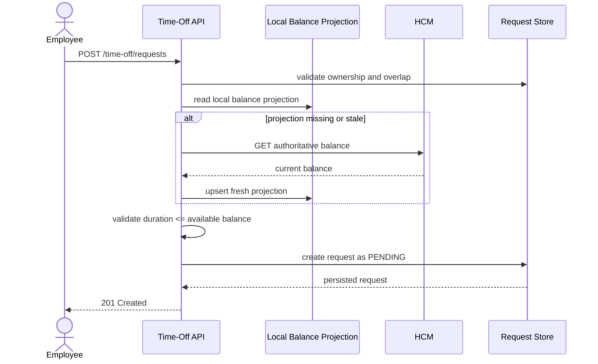
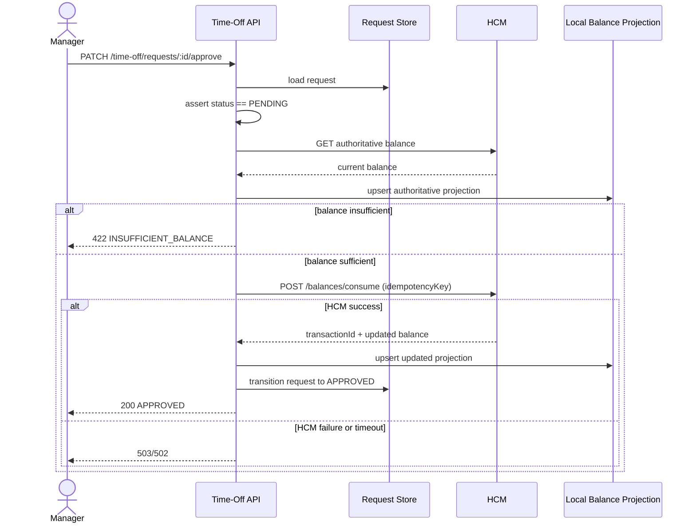
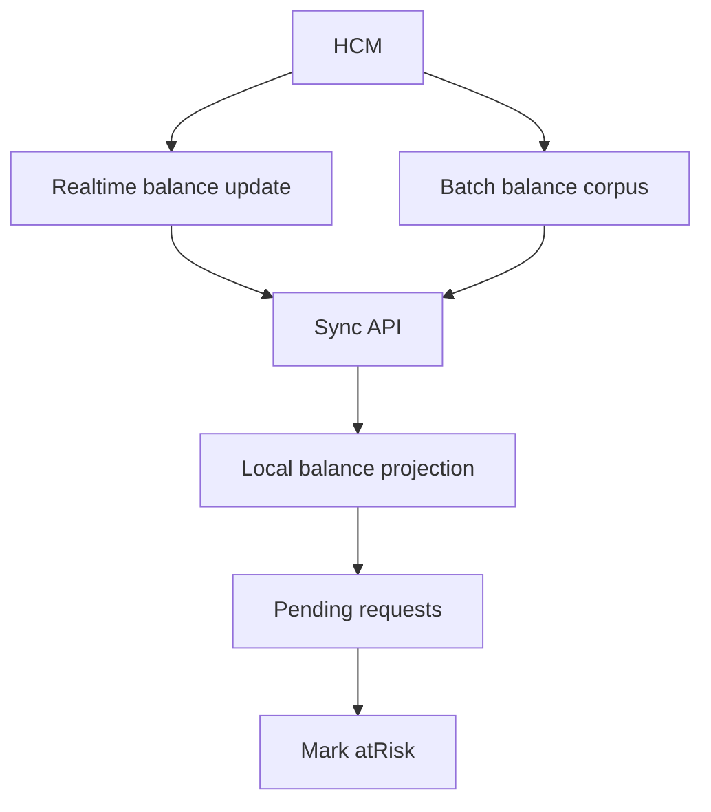
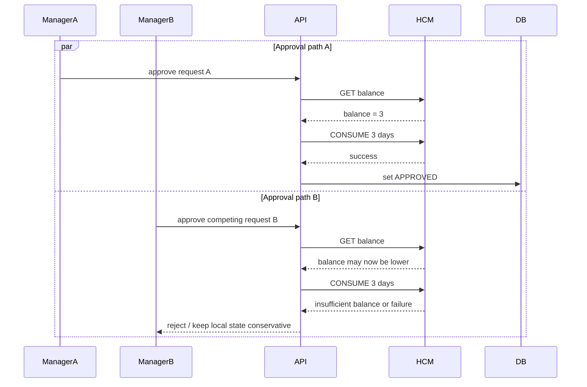
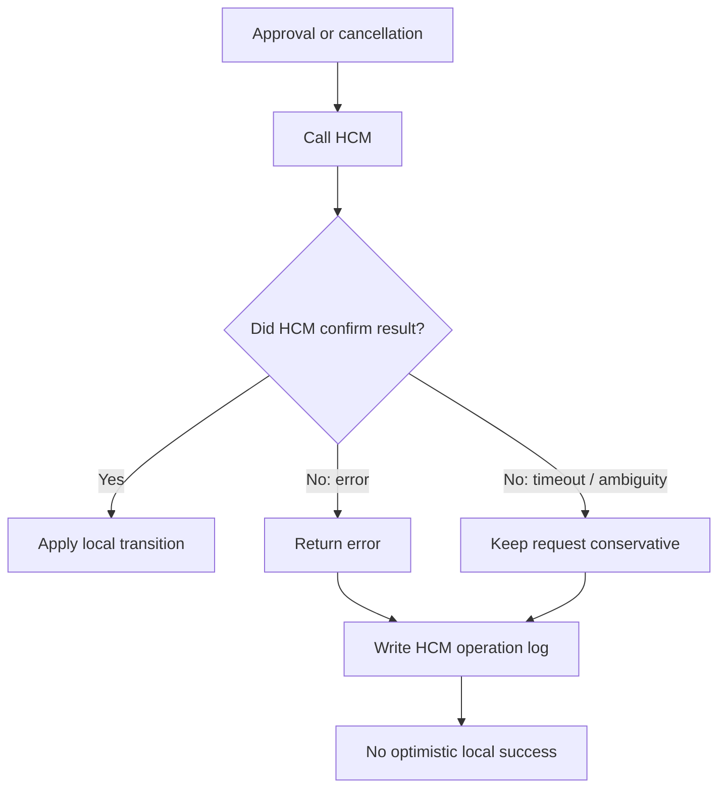

# Time-Off Microservice


> Microserviço backend para gerenciamento de solicitações de time-off com **HCM como fonte da verdade para saldo** e **estado local responsável pelo workflow das solicitações**.  
> A solução prioriza integridade de saldo, sincronização defensiva, auditoria, idempotência e evidência de qualidade por meio de testes.

## Índice
- [Visão geral](#visão-geral)
- [Contexto do desafio técnico](#contexto-do-desafio-técnico)
- [O problema](#o-problema)
- [Personas envolvidas](#personas-envolvidas)
- [Arquitetura da solução](#arquitetura-da-solução)
- [Diagramas](#diagramas)
- [Tecnologias escolhidas e justificativas](#tecnologias-escolhidas-e-justificativas)
- [Como executar](#como-executar)
- [Variáveis de ambiente](#variáveis-de-ambiente)
- [Endpoints da API](#endpoints-da-api)
- [Fluxos principais](#fluxos-principais)
- [Estratégia de sincronização com HCM](#estratégia-de-sincronização-com-hcm)
- [Estratégia de integridade de saldo](#estratégia-de-integridade-de-saldo)
- [Decisões técnicas](#decisões-técnicas)
- [Alternativas consideradas](#alternativas-consideradas)
- [Estrutura do projeto](#estrutura-do-projeto)
- [Testes](#testes)
- [Mock HCM](#mock-hcm)
- [Cenários críticos cobertos](#cenários-críticos-cobertos)
- [Limitações conhecidas](#limitações-conhecidas)
- [Próximos passos](#próximos-passos)
- [Autor](#autor)

## Visão geral
O **Time-Off Microservice** foi projetado para resolver um problema clássico de integração: permitir que empregados e gestores operem solicitações de afastamento com baixa latência e bom feedback de produto, sem violar o fato de que o **HCM continua sendo a autoridade final de saldo**.

Na prática, isso significa separar claramente duas responsabilidades:

- **HCM**
  - fonte da verdade para saldo
  - sistema externo que pode ser alterado por ReadyOn e por outros processos independentes
- **Time-Off Microservice**
  - autoridade local para o ciclo de vida da solicitação
  - cache/projeção local de saldo para leitura rápida
  - camada defensiva de validação, auditoria e sincronização

O resultado é um serviço que:
- cria solicitações com validação local + refresh defensivo quando necessário
- revalida o saldo no HCM antes da aprovação
- restaura saldo no HCM ao cancelar uma solicitação aprovada
- processa sincronização **batch** e **realtime**
- trata inconsistência, timeout e erro do HCM como eventos de primeira classe

## Contexto do desafio técnico
O desafio parte do cenário em que um módulo de time-off é a interface principal para colaboradores, enquanto um HCM externo, como Workday ou SAP, continua sendo o sistema mestre para dados de emprego e saldo.

Os requisitos centrais do desafio são:
- construir um backend com NestJS, TypeScript e SQLite
- manter a integridade do saldo mesmo com alterações externas no HCM
- tratar HCM como autoridade final
- suportar sincronização **realtime** e **batch**
- adotar uma abordagem defensiva contra erros incompletos ou inconsistentes do HCM
- usar testes como principal evidência de qualidade

Este repositório responde a esses requisitos com:
- API REST para solicitação, aprovação, rejeição, cancelamento e consulta de saldo
- cache/projeção local em SQLite
- cliente HCM com logging e normalização de erros
- mock HCM com cenários de seed, erro, delay lógico e mudanças externas de saldo
- suíte de testes unitários, integração e e2e

## O problema
Sincronizar saldos entre dois sistemas é difícil porque o serviço local **não é o único escritor** no HCM.

Os principais riscos deste domínio são:

- **stale reads**
  - o saldo consultado localmente pode já estar desatualizado no momento da aprovação
- **dual-writer**
  - o HCM pode ser alterado por processos externos, como bônus de aniversário ou refresh anual
- **insuficiência de saldo não reportada corretamente**
  - o HCM pode não devolver erro consistente em todos os cenários
- **concorrência**
  - duas ações simultâneas podem competir pelo mesmo saldo
- **ambiguidade em falhas**
  - timeout em escrita do HCM não pode ser tratado como sucesso otimista

O desenho da solução assume explicitamente que:
- **SQLite nunca é a fonte final de saldo**
- **aprovação sem revalidação no HCM é proibida**
- **falha ou ambiguidade no HCM mantém o estado local conservador**

## Personas envolvidas
| Persona | Objetivo | Risco principal | Resposta do sistema |
| --- | --- | --- | --- |
| Employee | Solicitar time-off e ver saldo confiável | receber saldo desatualizado ou aprovação ilusória | projeção local rápida + refresh do HCM quando stale |
| Manager | Aprovar com segurança | aprovar pedido já inválido no HCM | revalidação obrigatória antes da aprovação |
| HR / HCM | Aplicar mudanças externas de saldo | drift entre HCM e serviço local | sincronização batch + realtime |
| Engineering / Operations | Evoluir o sistema com segurança | regressões e inconsistência silenciosa | testes, auditoria e mock HCM reproduzível |

## Arquitetura da solução
O serviço segue uma arquitetura modular, com separação clara entre:

- **workflow local**
  - requests
  - autorização por headers mockados
  - auditoria
- **projeção local**
  - balances em SQLite
  - TTL de freshness
  - marcação de `atRisk`
- **integração externa**
  - leitura e escrita no HCM
  - normalização de erros
  - idempotência para operações de consume/restore

### Componentes principais
- `RequestsService`
  - cria, aprova, rejeita e cancela solicitações
- `BalancesService`
  - resolve leitura de saldo com política de freshness
- `SyncService`
  - processa sincronizações inbound do HCM
- `HcmClientService`
  - encapsula comunicação outbound com o HCM
- `SQLite / Prisma`
  - armazena estado do workflow e projeção local de saldo

### Modelo de consistência
- **saldo**
  - autoridade final: HCM
- **status da solicitação**
  - autoridade final: microserviço local
- **aprovação**
  - só ocorre após confirmação de consumo no HCM
- **cancelamento aprovado**
  - só é finalizado após confirmação de restore no HCM

## Diagramas
### 1. Diagrama de arquitetura (ASCII)

Visão lógica da solução. O diagrama mostra a arquitetura alvo do serviço; na entrega atual, SQLite mantém a aplicação em topologia single-node, mas a separação entre instâncias da API e a camada de estado permanece válida como fronteira de responsabilidade.

```text
┌──────────────────────────── Client Boundary ─────────────────────────────┐
│                                                                          │
│   ┌──────────────┐                           ┌──────────────┐             │
│   │   Employee   │                           │   Manager    │             │
│   └──────┬───────┘                           └──────┬───────┘             │
│          │                                              │                 │
└──────────┼──────────────────────────────────────────────┼─────────────────┘
           │                                              │
           ▼                                              ▼
┌────────────────────────── Time-Off Service Boundary ─────────────────────┐
│                                                                          │
│   ┌──────────────────┐            ┌──────────────────┐                   │
│   │  API Instance A  │            │  API Instance B  │                   │
│   │  NestJS / REST   │            │  NestJS / REST   │                   │
│   └────────┬─────────┘            └────────┬─────────┘                   │
│            │                               │                             │
│            └───────────────┬───────────────┘                             │
│                            ▼                                             │
│                 ┌──────────────────────────┐                              │
│                 │ Application Services     │                              │
│                 │ Requests / Balances      │                              │
│                 │ Sync / HCM Client        │                              │
│                 └────────────┬─────────────┘                              │
│                              │                                            │
│          ┌───────────────────┴───────────────────┐                        │
│          ▼                                       ▼                        │
│   ┌─────────────────────┐               ┌─────────────────────┐           │
│   │ SQLite              │               │ Audit / Sync Logs   │           │
│   │ Workflow State      │               │ HCM Operations      │           │
│   │ Balance Projection  │               │ Sync Runs           │           │
│   └─────────────────────┘               └─────────────────────┘           │
│                                                                          │
└───────────────────────────────┬───────────────────────────────────────────┘
                                │
                                ▼
┌──────────────────────── External System Boundary ────────────────────────┐
│                                                                          │
│   ┌──────────────────────────────────────────────────────────────────┐   │
│   │ HCM API                                                         │   │
│   │ - GET balance                                                   │   │
│   │ - CONSUME balance                                               │   │
│   │ - RESTORE balance                                               │   │
│   │ - Batch / Realtime sync source                                  │   │
│   └──────────────────────────────────────────────────────────────────┘   │
│                                                                          │
└──────────────────────────────────────────────────────────────────────────┘
```

Esse desenho destaca o ponto mais importante do domínio: **a API pode escalar logicamente, mas o saldo final não sai da base local; ele sempre precisa convergir com o HCM**.

### 2. Fluxo de criação de request de time-off



Esse fluxo existe para equilibrar **UX rápida** com **segurança de dados**. A criação usa a projeção local quando ela ainda é confiável, mas não hesita em consultar o HCM quando a projeção está stale ou ausente.

### 3. Fluxo de aprovação (crítico)



Esse é o centro da integridade do sistema. A aprovação **nunca** depende apenas do cache local. O HCM é consultado no momento crítico, e a transição local só acontece depois da confirmação externa.

### 4. Fluxo de sincronização (batch + realtime)



Esse fluxo cobre o fato de que o HCM pode mudar fora do microserviço. O papel do sync não é “validar pedidos”; é **reconstruir a projeção local** e sinalizar risco operacional nos pedidos pendentes.

### 5. Fluxo de concorrência / race condition



O sistema não assume que concorrência será resolvida apenas localmente. A garantia real vem da combinação de:
- revalidação no HCM
- escrita idempotente
- transição local conservadora em caso de erro

### 6. Fluxo anti-inconsistência



Esse fluxo mostra a regra defensiva principal da solução: **se o HCM não confirmou, o sistema local não inventa sucesso**.

## Tecnologias escolhidas e justificativas
| Tecnologia | Papel na solução | Justificativa |
| --- | --- | --- |
| NestJS | framework HTTP e composição modular | boa separação por módulos, controllers e providers |
| TypeScript | tipagem estática | reduz ambiguidade em domínio e contratos |
| Prisma | acesso a dados | produtividade, schema claro e integração forte com SQLite |
| SQLite | estado local + projeção de saldo | atende ao escopo do take-home com setup simples |
| `@prisma/adapter-better-sqlite3` | runtime adapter Prisma 7 | caminho suportado para SQLite com Prisma 7 |
| Jest | suíte de testes | padrão sólido para unit, integration e e2e |
| Supertest | testes HTTP | validação real das rotas REST |
| Mock HCM próprio | simulação do sistema externo | permite controlar seed, cenários de erro, inconsistência e introspecção |

## Como executar
### Execução local
1. Instalar dependências:

```bash
npm install
```

2. Gerar cliente Prisma e sincronizar schema:

```bash
npm run prisma:generate
npm run db:push
```

3. Semear usuários locais:

```bash
npm run db:seed
```

4. Subir o mock HCM em um terminal:

```bash
npm run mock:hcm
```

5. Subir a API em outro terminal:

```bash
npm run start:dev
```

### Observação sobre containerização
Esta entrega **não inclui Docker nem Docker Compose**, porque a containerização não faz parte do escopo implementado neste repositório. O caminho oficialmente suportado nesta submissão é execução local.

### Demo rápida
Reset do mock HCM:

```bash
curl -s -X POST http://127.0.0.1:4010/mock/reset
```

Seed de saldo no HCM:

```bash
curl -s -X POST http://127.0.0.1:4010/mock/seed-balance \
  -H 'content-type: application/json' \
  -d '{
    "employeeId":"emp-001",
    "locationId":"loc-nyc",
    "leaveType":"VACATION",
    "availableDays":10,
    "sourceUpdatedAt":"2026-04-24T00:00:00.000Z"
  }'
```

Sync batch inicial:

```bash
curl -s -X POST http://127.0.0.1:3000/sync/batch \
  -H 'content-type: application/json' \
  -d '{
    "balances":[
      {
        "employeeId":"emp-001",
        "locationId":"loc-nyc",
        "leaveType":"VACATION",
        "availableDays":10,
        "sourceUpdatedAt":"2026-04-24T00:00:00.000Z"
      }
    ]
  }'
```

Criação de solicitação:

```bash
curl -s -X POST http://127.0.0.1:3000/time-off/requests \
  -H 'content-type: application/json' \
  -H 'x-user-id: emp-001' \
  -H 'x-role: EMPLOYEE' \
  -d '{
    "employeeId":"emp-001",
    "locationId":"loc-nyc",
    "leaveType":"VACATION",
    "startDate":"2026-05-01",
    "endDate":"2026-05-03",
    "notes":"Trip"
  }'
```

## Variáveis de ambiente
| Variável | Obrigatória | Papel |
| --- | --- | --- |
| `DATABASE_URL` | sim | caminho do SQLite local |
| `HCM_BASE_URL` | sim | URL base do HCM mock ou HCM real |
| `HCM_PORT` | não | porta do runner manual do mock HCM |
| `BALANCE_TTL_MS` | sim | TTL da projeção local de saldo |
| `HCM_TIMEOUT_MS` | sim | timeout de chamadas outbound ao HCM |
| `PORT` | sim | porta da API NestJS |

Exemplo:

```env
DATABASE_URL="file:./dev.db"
HCM_BASE_URL="http://127.0.0.1:4010"
HCM_PORT="4010"
BALANCE_TTL_MS="300000"
HCM_TIMEOUT_MS="2000"
PORT="3000"
```

## Endpoints da API
### Identidade mockada
As rotas de usuário usam headers confiados:

```http
x-user-id: emp-001
x-role: EMPLOYEE
```

ou

```http
x-user-id: mgr-001
x-role: MANAGER
```

### Endpoints
| Método | Path | Descrição |
| --- | --- | --- |
| `GET` | `/health` | liveness check |
| `POST` | `/time-off/requests` | cria solicitação |
| `GET` | `/time-off/requests` | lista solicitações |
| `GET` | `/time-off/requests/:id` | busca solicitação |
| `PATCH` | `/time-off/requests/:id/approve` | aprova pendência |
| `PATCH` | `/time-off/requests/:id/reject` | rejeita pendência |
| `PATCH` | `/time-off/requests/:id/cancel` | cancela solicitação |
| `GET` | `/balances` | consulta projeção atual |
| `POST` | `/sync/realtime` | ingestão pontual de saldo |
| `POST` | `/sync/batch` | ingestão em lote |

### Payloads de exemplo
Criação de request:

```json
{
  "employeeId": "emp-001",
  "locationId": "loc-nyc",
  "leaveType": "VACATION",
  "startDate": "2026-05-01",
  "endDate": "2026-05-03",
  "notes": "Trip"
}
```

Aprovação:

```json
{
  "notes": "Approved"
}
```

Sync realtime:

```json
{
  "balance": {
    "employeeId": "emp-001",
    "locationId": "loc-nyc",
    "leaveType": "VACATION",
    "availableDays": 4,
    "sourceUpdatedAt": "2026-04-24T00:10:00.000Z"
  }
}
```

Erro padronizado:

```json
{
  "statusCode": 422,
  "error": "INSUFFICIENT_BALANCE",
  "message": "Requested 3 days but only 2 remain."
}
```

## Fluxos principais
### Criação
- valida identidade e ownership
- valida datas
- rejeita overlap
- usa projeção local quando fresca
- consulta HCM quando a projeção está stale ou ausente
- cria a solicitação como `PENDING`

### Aprovação
- exige role `MANAGER`
- recarrega solicitação
- revalida no HCM
- só consome localmente após `consume` confirmado no HCM
- atualiza projeção local com retorno do HCM

### Cancelamento
- `PENDING`: cancelamento local
- `APPROVED`: `restore` no HCM antes da transição local

### Sincronização
- `batch`: atualiza corpus local, respeitando `sourceUpdatedAt`
- `realtime`: atualiza dimensão específica e recalcula `atRisk`

## Estratégia de sincronização com HCM
O modelo de sincronização combina dois mecanismos complementares:

### Batch
Usado para reconstrução ampla da projeção local. Ele serve para convergir o estado do microserviço com a fotografia mais recente do HCM.

Características:
- ingestão de corpus completo
- upsert por dimensão
- descarte de payloads mais antigos que o `sourceUpdatedAt` local

### Realtime
Usado para mutações pontuais e mais recentes.

Características:
- atualização específica de uma dimensão
- recálculo de pedidos pendentes impactados
- marcação de `atRisk` sem transição automática de status

### Por que ambos existem
- batch resolve convergência global
- realtime resolve latência operacional
- juntos, reduzem drift sem depender apenas de leitura sob demanda

## Estratégia de integridade de saldo
Esta é a regra central do sistema:

> A projeção local serve para leitura e triagem, mas o HCM é a autoridade final antes de qualquer aprovação.

### Mecanismos usados
- TTL para projeção local
- refresh defensivo ao detectar staleness
- revalidação obrigatória no HCM antes de aprovar
- escrita idempotente no HCM para `consume` e `restore`
- falha conservadora em timeout ou erro ambíguo
- auditoria de operações HCM

### O que isso evita
- aprovação com saldo velho
- dupla aprovação por falso sucesso local
- cancelamento aprovado sem restore externo
- confiança cega em mensagens de erro do HCM

## Decisões técnicas
| Decisão | Motivo |
| --- | --- |
| REST em vez de GraphQL | o domínio é centrado em comandos explícitos |
| SQLite como estado local | atende ao take-home com setup simples e baixo atrito |
| HCM como fonte de verdade | alinhamento direto com o problema proposto |
| Revalidação obrigatória na aprovação | evita autorizar com saldo stale |
| Idempotency key em consume/restore | protege contra retries e ambiguidade |
| Sync batch + realtime | cobre tanto convergência global quanto atualização pontual |
| Auditoria local | rastreabilidade de integrações e falhas |

## Alternativas consideradas
| Alternativa | Vantagem | Motivo para não escolher |
| --- | --- | --- |
| Reservar saldo localmente na criação | feedback antecipado | quebra mais facilmente o modelo “HCM é autoridade final” |
| Outbox/eventual consistency para aprovação | maior robustez operacional | aumenta complexidade e enfraquece a aprovação síncrona segura |
| GraphQL | flexibilidade de leitura | não melhora os fluxos command-heavy deste desafio |
| PostgreSQL | melhor concorrência e escala | fora do escopo da stack obrigatória do take-home |

## Estrutura do projeto
```text
src/
├── audit/
├── balances/
├── common/
├── employees/
├── hcm/
├── integration/
├── prisma/
├── shared/
├── sync/
└── time-off/

test/
├── support/
└── time-off.e2e-spec.ts

docs/
├── time-off-microservice-trd.md
└── test-evidence.md

scripts/
└── mock-hcm-server.js
```

### Leitura rápida por responsabilidade
- `src/time-off`
  - workflow das solicitações
- `src/balances`
  - leitura e refresh da projeção de saldo
- `src/sync`
  - ingestão inbound do HCM
- `src/hcm`
  - integração outbound com HCM
- `test/support`
  - mock HCM realista para testes

## Testes
Testes são a principal evidência de qualidade desta entrega.

### Unitários
Cobrem:
- cálculo de duração
- overlap
- freshness TTL
- criação de solicitação
- aprovação defensiva
- rejeição e cancelamento
- sincronização batch e realtime

Arquivos principais:
- [src/shared/domain/time-off-policy.spec.ts](src/shared/domain/time-off-policy.spec.ts)
- [src/time-off/application/requests.service.spec.ts](src/time-off/application/requests.service.spec.ts)
- [src/time-off/application/requests.service.approve.spec.ts](src/time-off/application/requests.service.approve.spec.ts)
- [src/time-off/application/requests.service.lifecycle.spec.ts](src/time-off/application/requests.service.lifecycle.spec.ts)
- [src/balances/application/balances.service.spec.ts](src/balances/application/balances.service.spec.ts)
- [src/sync/application/sync.service.spec.ts](src/sync/application/sync.service.spec.ts)

### Integração
Cobrem:
- graph real de providers do Nest
- repositórios Prisma reais
- persistência local real
- HCM client mockado no nível de serviço

Arquivo principal:
- [src/integration/requests.integration.spec.ts](src/integration/requests.integration.spec.ts)

### E2E
Cobrem:
- fluxo HTTP completo
- integração com mock HCM real via socket local
- batch sync
- criação
- aprovação
- cancelamento aprovado
- marcação de `atRisk`

Arquivo principal:
- [test/time-off.e2e-spec.ts](test/time-off.e2e-spec.ts)

### Comandos de verificação
```bash
npm run lint
npm run build
npm test -- --runInBand
npm run test:integration
npm run test:e2e -- --runInBand test/time-off.e2e-spec.ts
npm run test:cov -- --runInBand
```

Atalho:

```bash
npm run verify
```

### Snapshot de coverage
Último snapshot local:
- Statements: `72.8%`
- Branches: `55.42%`
- Functions: `55.42%`
- Lines: `71.7%`

Detalhes adicionais:
- [docs/test-evidence.md](docs/test-evidence.md)

## Mock HCM
O projeto inclui um mock HCM com comportamento realista o suficiente para testes de integração e demonstração local.

### Capacidades
- seed de saldo por dimensão
- reset total de estado
- cenários de erro por operação
- introspecção de chamadas
- `consume` idempotente
- `restore` idempotente

### Endpoints do mock
| Método | Path | Uso |
| --- | --- | --- |
| `GET` | `/mock/health` | health check |
| `POST` | `/mock/seed-balance` | seed de saldo |
| `POST` | `/mock/set-scenario` | simula erro/inconsistência |
| `POST` | `/mock/reset` | limpa estado |
| `GET` | `/mock/calls` | mostra chamadas recebidas |
| `GET` | `/mock/state` | mostra snapshot do estado |
| `GET` | `/balances/:employeeId/:locationId/:leaveType` | consulta saldo |
| `POST` | `/balances/consume` | consome saldo |
| `POST` | `/balances/restore` | restaura saldo |

### Exemplo de cenário de erro
```bash
curl -s -X POST http://127.0.0.1:4010/mock/set-scenario \
  -H 'content-type: application/json' \
  -d '{
    "operation":"consume",
    "scenario":"unavailable"
  }'
```

## Cenários críticos cobertos
| Cenário | Comportamento esperado | Evidência |
| --- | --- | --- |
| saldo stale na criação | refresh no HCM antes de decidir | tests unitários + e2e |
| overlap de datas | rejeição local imediata | unit |
| aprovação com saldo insuficiente | rejeição sem transição local | unit + integration |
| timeout/erro do HCM na aprovação | request permanece conservador | unit |
| cancelamento de request aprovado | restore no HCM antes de `CANCELLED` | unit + e2e |
| update externo de saldo via sync | projeção local atualizada | sync tests |
| pending request impactado por novo saldo | marcação `atRisk` | sync tests + e2e |
| mock HCM com mudança externa, erro e inspeção | ambiente de prova reproduzível | mock HCM |

## Limitações conhecidas
- SQLite atende ao take-home, mas não é o destino ideal para concorrência pesada em produção.
- A topologia real da entrega é local/single-node; o diagrama com múltiplas instâncias representa a arquitetura lógica, não o deployment atual.
- Não há autenticação real; a identidade é mockada via headers por decisão de escopo.
- Não há calendário de feriados, regras de business days ou meio período.
- Não existe painel operacional para consulta de auditoria; os logs estão persistidos, mas não expostos em API própria.

## Próximos passos
- migrar SQLite para PostgreSQL
- endurecer política de concorrência com locking mais forte no armazenamento principal
- adicionar circuit breaker e retry policy mais explícitos no cliente HCM
- expor auditoria operacional para sync e operações HCM
- adicionar documentação OpenAPI/Swagger
- ampliar cobertura dos caminhos de erro do `HcmClientService`

## Autor
**daviixs**  
Backend take-home submission  
Contato: `xaviersilvadavi@gmail.com`
