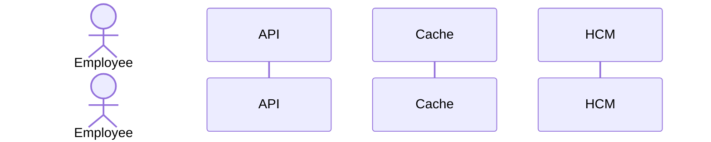

# README Redesign Implementation Plan

> **For agentic workers:** REQUIRED SUB-SKILL: Use superpowers:subagent-driven-development (recommended) or superpowers:executing-plans to implement this plan task-by-task. Steps use checkbox (`- [ ]`) syntax for tracking.

**Goal:** Rewrite `README.md` as a senior-level technical submission document for the Time-Off Microservice take-home challenge.

**Architecture:** The README will be rebuilt as an evaluator-facing document, not a generic setup guide. It will pull factual content from the existing TRD, test evidence, scripts, and live API surface, then restructure that material into a narrative centered on HCM as source of truth and the service as workflow authority.

**Tech Stack:** Markdown, Mermaid, ASCII diagrams, NestJS project metadata, existing TRD and test evidence

---

### Task 1: Re-establish README Structure

**Files:**

- Modify: `README.md`
- Reference: `docs/time-off-microservice-trd.md`
- Reference: `docs/test-evidence.md`

- [ ] **Step 1: Write the failing content checklist**

```markdown
- Missing badges
- Missing index
- Missing architecture diagrams
- Missing personas and explicit problem framing
- Missing sectioned technical decisions and alternatives
```

- [ ] **Step 2: Verify the current README fails that checklist**

Run: `sed -n '1,260p' README.md`
Expected: Existing README is functional but does not yet match the target section structure or diagram depth.

- [ ] **Step 3: Write the new top-level README skeleton**

```markdown
# Time-Off Microservice

## Overview

## Challenge Context

## Problem

## Personas

## Architecture

## Diagrams

...
```

- [ ] **Step 4: Verify the new structure is present**

Run: `rg -n "^## " README.md`
Expected: All required major sections appear in evaluator-friendly order.

- [ ] **Step 5: Commit**

```bash
git add README.md
git commit -m "docs: restructure README for evaluation"
```

### Task 2: Add Architecture Narrative and Diagrams

**Files:**

- Modify: `README.md`
- Reference: `docs/time-off-microservice-trd.md`

- [ ] **Step 1: Write the architecture and diagram content block**

````markdown
## Architecture

- HCM as source of truth
- SQLite as workflow state and projection cache
- Revalidation before approval

```text
[ Employee ] --> [ API Instance A ]
[ Manager  ] --> [ API Instance B ]
```
````



````

- [ ] **Step 2: Verify diagrams render as valid Markdown blocks**

Run: `rg -n "```mermaid|```text" README.md`
Expected: One ASCII architecture block and five Mermaid blocks are present.

- [ ] **Step 3: Add explanatory text after each diagram**

```markdown
This flow exists to prevent stale local approval decisions when HCM changed independently.
````

- [ ] **Step 4: Verify the README explains the diagrams rather than only embedding them**

Run: `sed -n '1,320p' README.md`
Expected: Each diagram is followed by a short explanation of risk and consistency guarantees.

- [ ] **Step 5: Commit**

```bash
git add README.md
git commit -m "docs: add README architecture diagrams"
```

### Task 3: Add Execution, API, and Evidence Sections

**Files:**

- Modify: `README.md`
- Reference: `package.json`
- Reference: `scripts/mock-hcm-server.js`
- Reference: `docs/test-evidence.md`

- [ ] **Step 1: Add local execution and environment sections**

```markdown
## How to Run

### Local Execution

### Containerization Note

## Environment Variables

| Variable | Purpose | Required |
```

- [ ] **Step 2: Add API endpoint tables and payload examples**

````markdown
## API Endpoints

| Method | Path | Description |

```json
{
  "employeeId": "emp-001",
  "locationId": "loc-nyc",
  "leaveType": "VACATION"
}
```
````

````

- [ ] **Step 3: Add testing, mock HCM, critical scenarios, limitations, and next steps**

```markdown
## Tests
### Unit
### Integration
### E2E

## Mock HCM
## Critical Scenarios Covered
## Known Limitations
## Next Steps
````

- [ ] **Step 4: Verify factual consistency against scripts and docs**

Run: `sed -n '1,260p' package.json`
Expected: All commands referenced in README exist in package scripts.

- [ ] **Step 5: Commit**

```bash
git add README.md
git commit -m "docs: add README execution and evidence sections"
```

### Task 4: Final Editorial Pass

**Files:**

- Modify: `README.md`

- [ ] **Step 1: Tighten language for evaluator readability**

```markdown
Replace vague claims like "robust" with concrete statements like
"approval always revalidates the authoritative HCM balance before local status transition".
```

- [ ] **Step 2: Verify headings, tables, and diagrams are coherent**

Run: `sed -n '1,400p' README.md`
Expected: README reads as a senior-level technical submission, not a generic project scaffold.

- [ ] **Step 3: Run final documentation verification**

Run: `npm run lint`
Expected: PASS

- [ ] **Step 4: Commit**

```bash
git add README.md
git commit -m "docs: finalize technical README"
```
